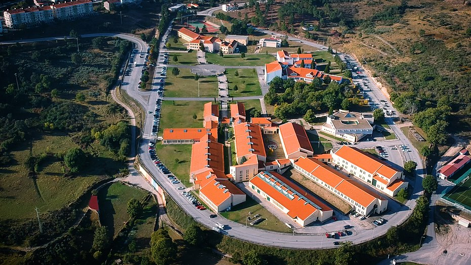

# aluno_CM_1704487
nome: rodrigo silva
numero: 1704487
curso: Comunicação Multimédia

redbull racing

branch auxiliar

26 de setembro de 2022

# nome do projecto
F1 Showcase
## 1. Descrição do Trabalho
Aplicação focada em mostrar os aspetos visuais dos carros de Formula 1 de 2022 (10 equipas)
## 2. Activities Criadas

Página inicial - Poderá ter botões de login e registo.
## 3. Navegação entre as activities
Por definir
## 4. Trabalho nos Interfaces
VisitOvar - Interface baseada como protótipo prático, desenvolvido com a ferramenta Adobe XD. A interface consistia numa interação de turistas com os locais da cidade, onde os mesmos poderiam escolher em que alojamentos ficar, que rotas escolher, e até usar AR (Augmented Reality/Realidade Aumentada) para visualizar edifícios históricos.
## 5. Assets do trabalho escolhidos

## 6. Assets usados no trabalho

## 7. Conclusão
// descrever brevemente o que se fez e o que faltou faze