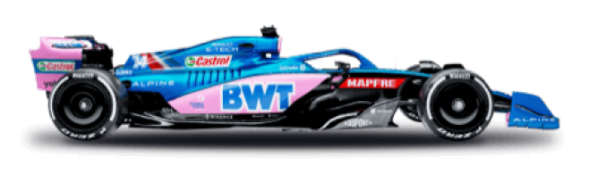

# aluno_CM_1704487
nome: rodrigo silva
numero: 1704487
curso: Comunicação Multimédia

redbull racing

branch auxiliar

26 de setembro de 2022

# nome do projecto
F1 Showcase
## 1. Descrição do Trabalho
Aplicação focada em mostrar os aspetos visuais dos carros de Formula 1 de 2022 (10 equipas). Para cada um delas, foi criada uma activity onde demonstre os carros e um respetivo briefing.

Foi implementado também um menu hambúrguer funcional com acesso à galeria de equipas (Teams) e sobre a aplicação (About).

## 2. Activities Criadas

Página inicial - Poderá ter botões de login e registo.
## 3. Navegação entre as activities
A navegação entre activities dá-se da seguinte forma.
A activity “Team screen” simboliza todas as equipas

## 4. Trabalho nas Interfaces
Landing screen:
ImageView de um drawable;
Button para aceder ao ecrã principal;
TextView para indicar a versão da aplicação.

	Main screen:
Implementação de um GridLayout com CardViews;
Cada CardView tem uma imagem e um texto associados, compostos numa RelativeLayout;
As CardView possuem onClick para serem clicáveis;
Associação de uma Navigation Drawer.

	Team screen:
TextView descritivo do nome da equipa;
ImageView com o carro respetivo da equipa;
TextView;
TextView com largura de 350dp para estruturar o texto.

	Drawer screen:
Possui um drawer header que mostre a ImageView;
Possui itens clicáveis que criam a interação entre os fragmentos compostos na navigation drawer.

	About screen:
Apenas composto por textView. Títulos estão em bold.

## 5. Assets do trabalho escolhidos

## 6. Assets usados no trabalho

## 7. Conclusão
O projeto correu de acordo com o planeado na definição do mesmo.

Criação gráfica do logótipo (.svg e .png);
Aquisição de imagens e conteúdo para a descrição das equipas e carros;
Desenho das várias janelas da interface e a sua relação entre si + cálculo das Activities necessárias;
Criação das Activities;
